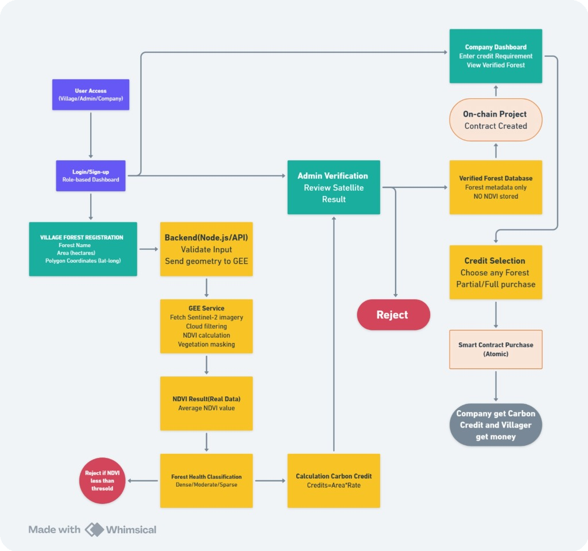

# 🌱 VANSHI
> **Satellite-Verified Carbon Credit Infrastructure for Community Forests**
>
> 🌐 **Website Link:** [vanshi-murex.vercel.app](https://vanshi-murex.vercel.app/) <br>
> 📹 **Website Explanation:** [Watch Video](https://drive.google.com/file/d/1ls4bCxMdZupINYbehvaI_Nn8mYQRhPVr/view?usp=drivesdk) <br>
> 📄 **Project Explanation:** [View Document](https://drive.google.com/file/d/1T4YZkm9MVB9vtZ1dL5MvTVQSlMJhKRo7/view?usp=sharing)

**Project Domain:** Governance
_(sub domains: Blockchain + Web + Open Innovation)_
## 🔍 Why VANSHI Exists

Climate action today depends heavily on forests — but the responsibility and rewards are deeply unequal.

Across India, thousands of village and community-managed forests are protected, maintained, and conserved for free by local people. Villagers limit deforestation, manage resources responsibly, and preserve ecosystems as a part of their everyday life — not as a paid service, but as a responsibility passed across generations.

At the same time, companies around the world are under increasing pressure to:
*   Reduce emissions
*   Offset unavoidable carbon footprints
*   Prove ESG compliance

However, companies face a different problem: they want to buy carbon credits, but struggle to find trustworthy, verifiable sources. Many existing carbon credits rely on self-reported data, manual surveys, or opaque verification processes, exposing buyers to the risk of greenwashing.

### The Resulting Gap
*   **Forests are protected without compensation**
*   **Companies search for credible carbon credits**
*   **Middlemen dominate access and capture most value**
*   **Trust in carbon markets continues to erode**

> 👉 **The core challenge consists of two parts:**
> 1. Not a lack of forests or buyers.
> 2. The absence of a trusted, scalable bridge between the two.

---

## 💡 What VANSHI Builds

**VANSHI** is a carbon verification and accounting infrastructure that connects community forests directly with carbon buyers through objective satellite verification and blockchain-backed trust.

*   Instead of asking villagers to prove their forest through costly audits, VANSHI verifies forest health **independently from space**.
*   Instead of asking companies to trust intermediaries, VANSHI provides **immutable on-chain proof** of ownership and retirement.

> **VANSHI does not create new forests.**
> It recognizes, verifies, and rewards forests that already exist.

### 🧠 Core Design Philosophy
> **"Ecological truth stays off-chain. Economic truth is enforced on-chain."**

1.  **Satellites** observe reality.
2.  **Backend** interprets environmental science.
3.  **Blockchain** guarantees ownership and finality.
4.  No component is overloaded or misused.

---

## 🏗 System Overview (End-to-End Flow)



🔵 **Blue**: Initial mandatory step • 🟢 **Green**: Dashboard Access • 🟡 **Yellow**: Process <br>
🟠 **Orange**: Blockchain • 🔴 **Red**: Reject • ⚪ **Grey**: End of project

1.  **Community Forest (Reality)**
    ↓
2.  **Satellite Observation (Sentinel-2)**
    ↓
3.  **NDVI-Based Vegetation Measurement**
    ↓
4.  **Forest Verification & Density Classification**
    ↓
5.  **Rule-Based Carbon Credit Estimation**
    ↓
6.  **Blockchain Credit Minting (ERC-1155)**
    ↓
7.  **Decentralized Marketplace (USDC)**
    ↓
8.  **Credit Retirement (Permanent Burn)**

*Every step is independently verifiable and tamper-resistant.*

---

## 🌍 Platform Users

### 🌳 Village / Forest Communities
*   Register forest using geographic coordinates.
*   Get satellite-verified forest assessment.
*   Earn directly from conserved forests.
*   **No dependency on agents or auditors.**

### 🏢 Corporate Carbon Buyers
*   Purchase verifiable carbon credits.
*   Track ownership transparently on-chain.
*   Retire credits with public proof.
*   Reduce ESG and compliance risk.

### 🛡 Platform Admin
*   Oversees workflow integrity.
*   **Cannot** modify NDVI or carbon values.
*   Acts as governance, not authority.

---

## 🛰 Forest Verification Pipeline

### 1️⃣ Geometry-Based Area Validation
*   User submits latitude, longitude, and claimed area.
*   System auto-generates a verification polygon.
*   Prevents exaggerated or false land claims.
*   **📐 Ensures spatial honesty.**

### 2️⃣ Satellite-Based Vegetation Measurement
*   **Satellite**: Sentinel-2 (ESA)
*   **Bands Used**: Red (`B4`), Near-Infrared (`B8`)

```math
NDVI = (NIR - RED) / (NIR + RED)
```
*Healthy vegetation absorbs red light and reflects near-infrared, resulting in higher NDVI values.*

### 3️⃣ Forest Density Classification

| NDVI Range    | Interpretation      |
| :------------ | :------------------ |
| `>= 0.65`     | **Dense Forest**    |
| `0.45 - 0.65` | **Moderate Forest** |
| `0.30 - 0.45` | **Sparse Forest**   |
| `< 0.30`      | Rejected            |

> *Forests below threshold are automatically excluded — no manual overrides.*

---

## 🌱 Translating Nature into Carbon Assets

VANSHI applies transparent and conservative carbon accounting.

```math
Annual Credits = Forest Area * Carbon Rate
```

> **1 Credit = 1 tCO₂e**

### Carbon Rates

| Forest Type      | Carbon Capture (tCO₂/ha/year) |
| :--------------- | :---------------------------- |
| **Dense**        | 28                            |
| **Moderate**     | 22                            |
| **Sparse**       | 15                            |
| **Rejected**     | 0                             |

*Simple, auditable, defensible.*

---

## 🔗 Role of Blockchain (Trust Layer)

Blockchain is used **only** where trust and finality are required.

### ❌ Not used for:
*   NDVI computation
*   Satellite imagery
*   Environmental modeling

### ✅ Used for:
*   Carbon credit issuance (ERC-1155)
*   Ownership tracking
*   Marketplace settlement
*   Fee enforcement
*   Credit retirement (burning)

*This prevents double counting, credit reuse, and post-retirement resale.*

---

## 🔥 Carbon Credit Retirement

When a buyer retires a credit:
1.  The token is **burned on-chain**.
2.  It is **permanently removed** from circulation.
3.  **Public proof** of climate offset is generated.
4.  This is the final and irreversible step.

---

## 🌱 Why VANSHI Matters
*   **Villagers** are finally compensated for conservation.
*   **Companies** gain reliable, defensible carbon credits.
*   **Verification costs** drop drastically.
*   **Trust** in carbon markets is restored.
*   **Climate responsibility** becomes fair and scalable.

---

## 💻 Developer Guide

### 🚀 Quick Start
This project is a monorepo containing the Backend (Express), Frontend (React/Vite), and Smart Contracts (Hardhat).

- **Backend**: [Documentation & Setup](./backend/README.md)
- **Frontend**: [Documentation & Setup](./frontend/README.md)
- **Contracts**: [Documentation & Setup](./contracts/README.md)
- **GEE Service**: [Documentation & Setup](./GEE-Service/README.md)

### 🔮 Future Roadmap
- **Round-2 Improvements**: [Read the full roadmap](./README.nextRound.md)

### Cloning & Installation
```bash
git clone <repository-url>
cd Vanshi
```

Please refer to the specific folders for detailed setup instructions.
